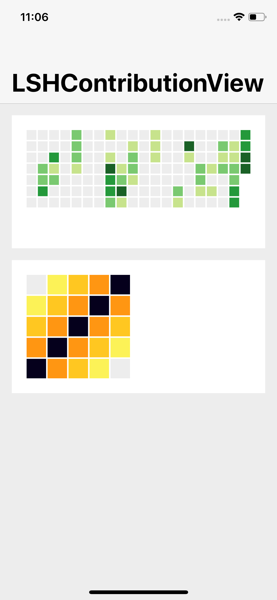

# LSHContributionView

[](https://developer.apple.com/swift) [](http://cocoapods.org/pods/LSHContributionView) [](http://cocoapods.org/pods/LSHContributionView) [](http://cocoapods.org/pods/LSHContributionView)

Contribution view similar to Contribution Graph on GitHub



## Features

- Customizable color scheme
- Automatic resizing and scaling

## Installation

### CocoaPods

To install `LSHContributionView` via [CocoaPods](http://cocoapods.org), add the following line to your Podfile:

```
pod 'LSHContributionView'
```

### Carthage

Soon

## Usage

See the example Xcode project. It contains:
- **LSHContributionViewExample** - a simple example containing two contribution views

### Interface Builder

`LSHContributionView` can be set up in Interface Builder. To use it, set the custom view class to `LSHContributionView`. Some of the control's parameters can be customized in Interface Builder.

### Code

```swift
let dataSquare = [
            [0, 1, 2, 3, 4],
            [1, 2, 3, 4, 3],
            [2, 3, 4, 3, 2],
            [3, 4, 3, 2, 1],
            [4, 3, 2, 1, 0]
        ]
   
let contributionView = LSHContributionView(frame: CGRect(x: 100, y: 100, width: 200, height: 180))
contributionView.data = dataSquare
contributionView.colorScheme = "Halloween"
view.addSubview(contributionView)
```

Add and Update Entry:
```swift
contributionView.addEntry(with: CGPoint(x: 2, y: 2), level: 1)
```

Adjust Spacing and Margin:
```swift
contributionView.gridSpacing = 0
contributionView.gridMargin = 10
```

Available Color Schemes:
- Default
- Halloween
- Blue

## Requirements

- iOS 10.0
- Xcode 10, Swift 4.2

## License

`LSHContributionView` is available under the MIT license. See the LICENSE file for more info.